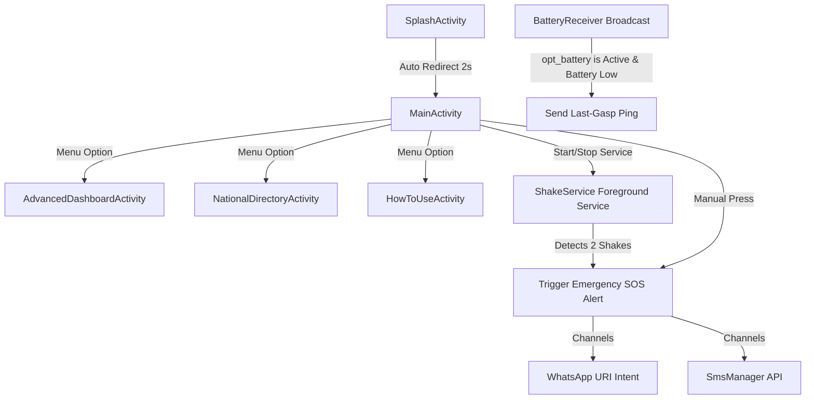

# 🚨 AnomX - Project Structure & Developer Reference

Welcome to the **AnomX** technical reference guide. This document provides a detailed breakdown of the codebase architecture, file structure, core application flows, and configuration setup. It also includes a **Track Record / Changelog** section at the end to trace version history and log future changes.

---

## 📌 Project Overview
* **Name:** AnomX (Personal Emergency Response System)
* **Publisher/Developer:** Eurt-labs
* **Platform:** Android 12+ (API Level 31 to 36)
* **Language:** Kotlin (JVM 11 target)
* **UI Framework:** XML Layouts & Material Design 3 (Note: Compose dependencies are defined in `libs.versions.toml` and imported in `build.gradle.kts`, but `buildFeatures.compose` is currently disabled).
* **Package Name:** `com.example.anomx`

---

## 🛠️ System Architecture & Key Features



### 1. One-Tap SOS & Alert Channels
* **SMS Mode:** Uses Android's `SmsManager` to send alert messages directly to the contacts list stored in `SharedPreferences`.
* **WhatsApp Mode:** Formulates a `https://wa.me/<number>?text=<encoded_msg>` link and opens WhatsApp using an `ACTION_VIEW` intent. WhatsApp mode is capped at exactly **one contact** due to API limitations.
* **Location Lookup:** Leverages Google Play Services `FusedLocationProviderClient` to get the latest high-accuracy coordinates (`Priority.PRIORITY_HIGH_ACCURACY`). If available, a Google Maps link (`https://maps.google.com/?q=<lat>,<lon>`) is generated and sent.

### 2. Shake-to-Alert Service
* Operated via `ShakeService.kt`, which runs as an Android **Foreground Service** (`FOREGROUND_SERVICE_LOCATION` type).
* Displays a persistent notification to prevent Android from killing the service in the background.
* Listens to the `Sensor.TYPE_ACCELEROMETER` with a threshold speed of `> 25 m/s²`.
* Requiring **two rapid shakes** (within a 3-second window, separated by at least 500ms) to prevent false positives, it automatically fires the emergency alert with location retrieval.

### 3. Last-Gasp Battery Ping
* Managed by `BatteryReceiver.kt`, a Broadcast Receiver registered for `ACTION_BATTERY_LOW`.
* If the user enables the feature in `AdvancedDashboardActivity`, this receiver automatically sends a critical battery message with the last known location when the device's battery level drops low, giving emergency contacts a final update before the phone shuts down.

### 4. Interactive Maps
* The main dashboard contains a WebView (`mapWebView`) that embeds Google Maps via an iframe pointing to `https://maps.google.com/maps?q=<lat>,<lon>&output=embed` based on the user's latest coordinates.

---

## 📁 Directory Structure & File Index

Below is the directory mapping of the AnomX repository:

```yaml
AnomX/
│
├── .idea/                      # Android Studio IDE settings
│
├── app/                        # Main Application Module
│   ├── build.gradle.kts        # Module-level Gradle configuration (versions, SDK dependencies)
│   ├── proguard-rules.pro      # ProGuard rules for code shrinking and obfuscation
│   │
│   └── src/
│       ├── main/
│       │   ├── AndroidManifest.xml   # App manifests, permissions, services, activities, receivers
│       │   │
│       │   ├── java/com/example/anomx/
│       │   │   ├── MainActivity.kt               # Core UI handler: contacts, SOS execution, web map view
│       │   │   ├── AdvancedDashboardActivity.kt # Configuration for Battery Ping & Breadcrumbs options
│       │   │   ├── NationalDirectoryActivity.kt # Key national emergency helpline dialers
│       │   │   ├── HowToUseActivity.kt          # Instructional activity utilizing fade animations
│       │   │   ├── SplashActivity.kt            # Launch activity, loads for 2 seconds
│       │   │   ├── ShakeService.kt              # Background service listening for hardware shakes
│       │   │   ├── BatteryReceiver.kt           # Listens for critical low-battery triggers
│       │   │   │
│       │   │   └── ui/theme/                    # Placeholder files for Compose themes (unused)
│       │   │       ├── Color.kt
│       │   │       ├── Theme.kt
│       │   │       └── Type.kt
│       │   │
│       │   └── res/                             # Android Application Resources
│       │       ├── anim/                        # Transition animations (e.g. fade_slide_up.xml)
│       │       ├── drawable/                    # Drawables & graphic assets (e.g. ic_anomx_logo.png)
│       │       ├── layout/                      # UI design XMLs for activities and custom dialogs
│       │       ├── menu/                        # Toolbar drop-down menus (e.g. main_menu.xml)
│       │       ├── values/                      # Style schemes, string resources, and color palettes
│       │       └── xml/                         # Device backup rules & data configurations
│       │
│       ├── androidTest/        # Android instrumentation tests
│       └── test/               # Local JVM unit tests
│
├── docs/                       # Project assets and design document images
│   ├── anomx_mockup.html       # Web-based interactive mockup of the app UI
│   ├── app_animation.webp      # Animated preview of the application workflow
│   ├── ui_main.png             # Screenshot of the main dashboard UI
│   └── ui_advanced.png         # Screenshot of the advanced features menu
│
├── gradle/                     # Gradle wrapper resources & Version Catalog
│   ├── libs.versions.toml      # Dependency & plugin centralized declarations (Version Catalog)
│   └── wrapper/                # Gradle wrapper runtime binaries
│
├── build.gradle.kts            # Project-level Gradle build file
├── settings.gradle.kts           # Root gradle configuration for subprojects & repositories
├── gradle.properties           # Gradle configuration properties
├── gradlew                     # Gradle wrapper CLI executable for Unix
├── gradlew.bat                 # Gradle wrapper CLI executable for Windows
├── .gitignore                  # Version control ignore rules
└── README.md                   # High-level project summary and setup instructions
```

---

## 🔒 Declared Permissions

The following permissions are requested in [AndroidManifest.xml](file:///c:/Users/Dhruv%20Saraswat/Documents/Projects/AnomX/app/src/main/AndroidManifest.xml):

* 📍 `ACCESS_FINE_LOCATION` & `ACCESS_COARSE_LOCATION`: Required to retrieve accurate coordinates for the Google Maps iframe and location SOS messages.
* 💬 `SEND_SMS`: Required to automatically dispatch emergency text messages using `SmsManager`.
* 🌐 `INTERNET`: Required to display the location map inside the WebView and trigger WhatsApp intents.
* 📳 `VIBRATE`: Required to send haptic feedback confirmation to the user when an SOS is sent or service toggles.
* 👤 `FOREGROUND_SERVICE` & `FOREGROUND_SERVICE_LOCATION`: Required to run `ShakeService` continuously in the background with access to location sensors even if the user exits the main application screen.

---

## 🚀 Version Track Record & Changelog

This log is used to track changes, updates, refactoring, and features implemented in the AnomX repository. When modifying code, developers should update this table to preserve historical context.

| Date (UTC) | Version | Category | Description | Committer / Author | Reference Files |
| :--- | :--- | :--- | :--- | :--- | :--- |
| **2026-07-16** | `v2.4.0` | Initial Baseline | Main features established: Shake-to-SOS background service, Low Battery Broadcast Receiver, WebView Embedded GPS Map, WhatsApp & SMS toggle routing, and National emergency contacts directory UI. | Eurt-labs | [MainActivity.kt](file:///c:/Users/Dhruv%20Saraswat/Documents/Projects/AnomX/app/src/main/java/com/example/anomx/MainActivity.kt), [ShakeService.kt](file:///c:/Users/Dhruv%20Saraswat/Documents/Projects/AnomX/app/src/main/java/com/example/anomx/ShakeService.kt), [BatteryReceiver.kt](file:///c:/Users/Dhruv%20Saraswat/Documents/Projects/AnomX/app/src/main/java/com/example/anomx/BatteryReceiver.kt) |
| *Future Date* | `vX.Y.Z` | *E.g., Feature* | *Describe future changes here.* | *Developer Name* | *Affected Files* |

---

### 💡 Guidelines for Future Updates
When implementing new features or fixing bugs in this repository, follow these steps to keep the documentation healthy:
1. **Increment Version:** Update `versionName` inside [app/build.gradle.kts](file:///c:/Users/Dhruv%20Saraswat/Documents/Projects/AnomX/app/build.gradle.kts) if introducing major/minor features or fixes.
2. **Log the Change:** Add a new line to the **Version Track Record** above detailing the update date, version, category, a clear description, your name, and references to the modified files.
3. **Verify Dependencies:** If you need to add dependencies, declare them inside the Version Catalog [gradle/libs.versions.toml](file:///c:/Users/Dhruv%20Saraswat/Documents/Projects/AnomX/gradle/libs.versions.toml) instead of hardcoding version strings in gradle scripts.
4. **Update Status Codes:** If implementing features currently marked "In Development" (e.g., Breadcrumbs/GPS Auto-updates), remember to update their status from 🔴 to 🟢 in [README.md](file:///c:/Users/Dhruv%20Saraswat/Documents/Projects/AnomX/README.md) and list the changes.
